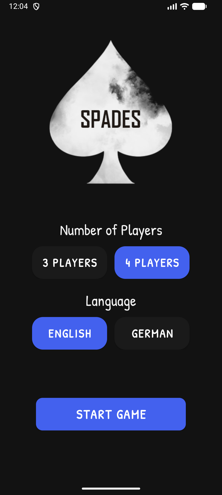
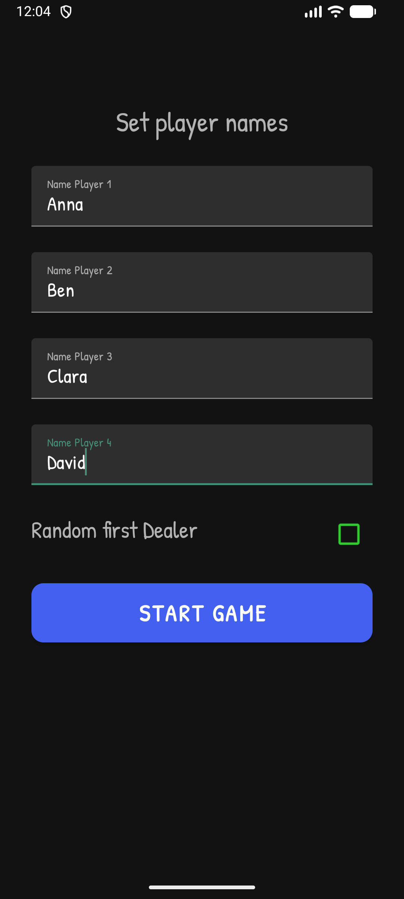
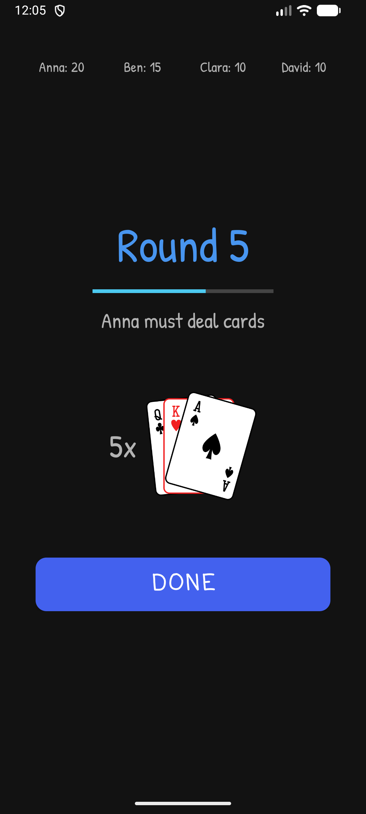
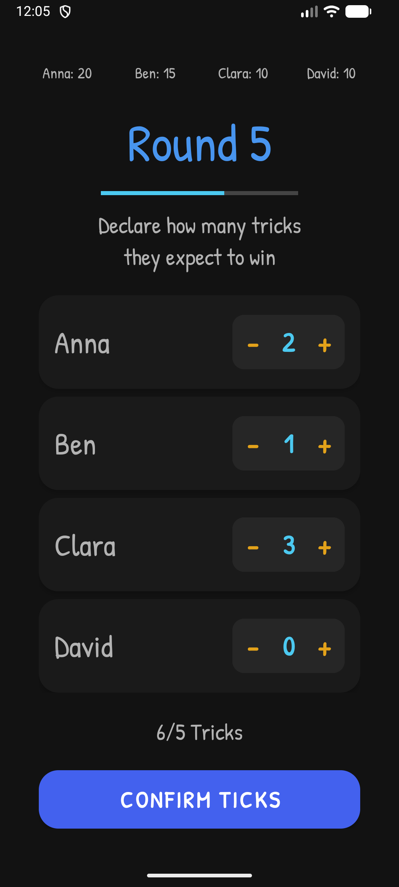
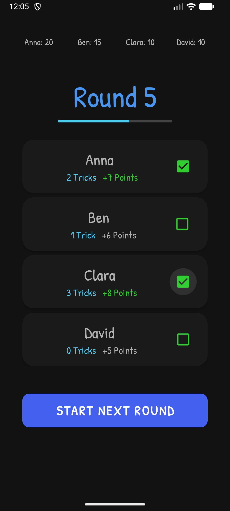
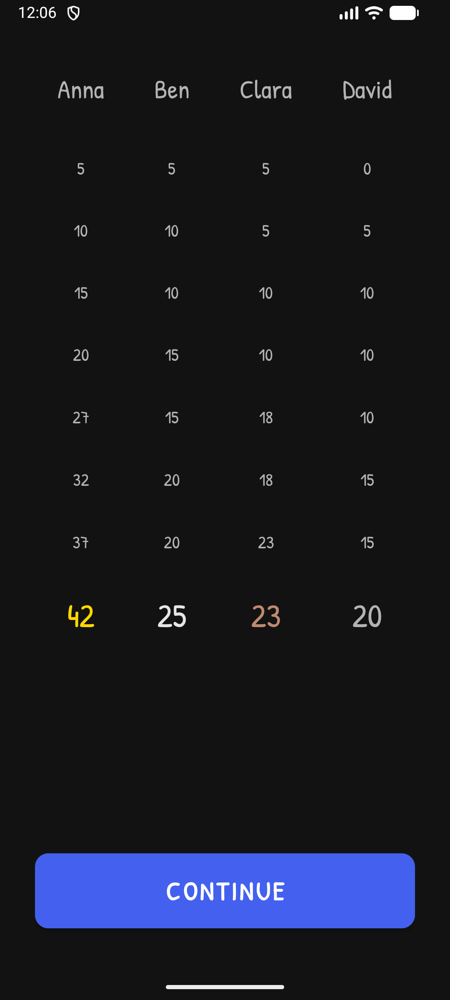
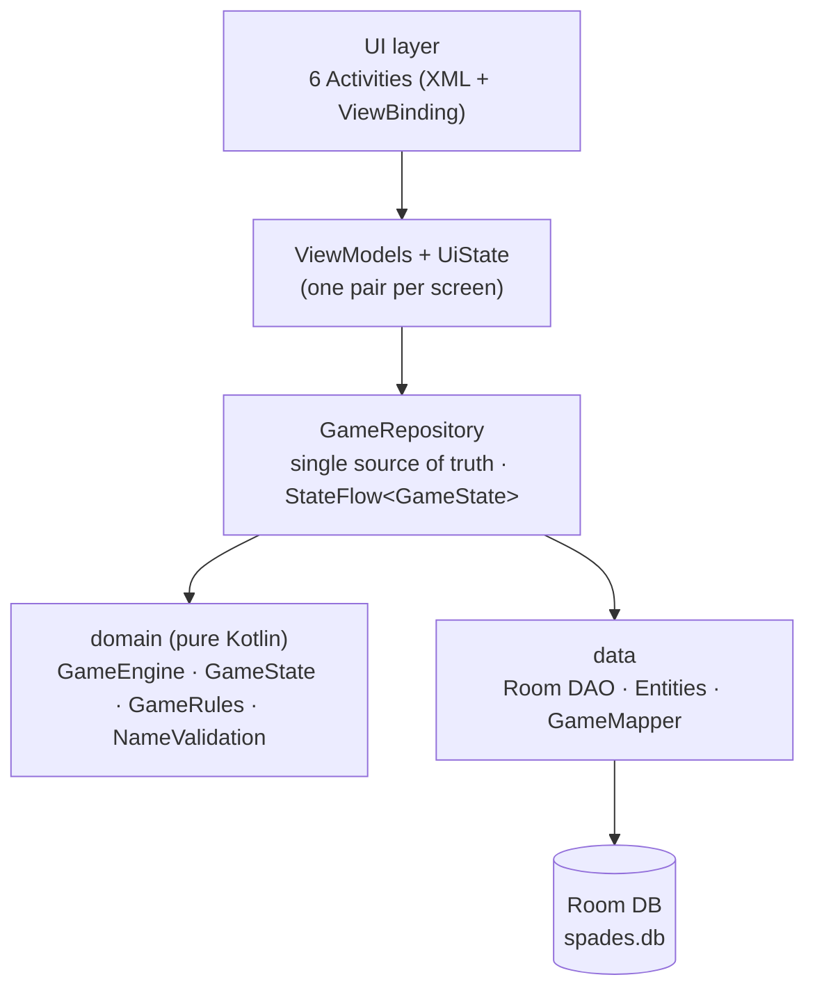
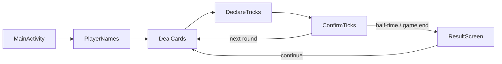

<div align="center">


# SpadesScore

**Pen-and-paper scoring for a Spades-style trick-prediction card game — on your phone.**

Set up the table, let each player bid their tricks, and the app keeps every round's score for you.


-blue)


</div>

---

## 📋 Overview

SpadesScore takes the maths out of a Spades-style trick-prediction card game. Each round, every player declares how many tricks they expect to win; afterwards you simply tick off who was right and the app handles the scoring, the dealer rotation, the changing card count, and the half-time and final tables. The game state is persisted, so it survives closing the app or the system killing it in the background.

## 📱 Screenshots

<table>
  <tr>
    <td align="center"><br/><sub><b>Start a game</b></sub></td>
    <td align="center"><br/><sub><b>Enter players</b></sub></td>
    <td align="center"><br/><sub><b>Who deals &amp; how many</b></sub></td>
  </tr>
  <tr>
    <td align="center"><br/><sub><b>Declare tricks</b></sub></td>
    <td align="center"><br/><sub><b>Confirm &amp; score</b></sub></td>
    <td align="center"><br/><sub><b>Half-time &amp; final table</b></sub></td>
  </tr>
</table>

> Screenshots are taken from the running app on an emulator with demo data and reflect the current UI.

## ✨ Features

- **3 or 4 players** — pick your table size when you start a new game.
- **Built-in trick prediction** — each player declares their expected tricks with a clean `+`/`−` stepper before the round.
- **Automatic scoring** — a correct prediction is worth the bid **plus 5**; the running total is tracked for every player.
- **Bid validation** — the table's bids can't add up to exactly the number of available tricks; the start button locks (and shakes) until the bids are legal.
- **Two halves with a half-time summary** — the card count ramps **up** over the first half and back **down** over the second, with a score overview at the break and a full results table at the end.
- **Medal highlighting** — the final column marks gold / silver / bronze for the top three.
- **Random starting dealer** — optionally let the app pick who deals first; the dealer rotates each round.
- **Persistent game state** — close the app or get killed in the background and the game (round, scores, names, language) is restored.
- **English & German** — switch the language right from the start screen.
- **Light & dark theme** — follows your device's appearance.

## 🛠️ Tech Stack

| Area | Choice |
| --- | --- |
| Language | **Kotlin** 2.2.21 (100% Kotlin) |
| UI | Android **XML layouts** + **ViewBinding** (no Compose) |
| Architecture | **MVVM** — `domain` / `data` / `ui` / `di` layers |
| State & async | **Kotlin Coroutines** + **StateFlow** |
| Persistence | **Room** 2.8.4 (KSP-processed) |
| Dependency injection | Manual — a single hand-written `AppContainer` |
| Lifecycle | AndroidX Lifecycle **ViewModel** |
| Build | **Gradle** 8.14.5, **AGP** 8.13.1, version catalog (`libs.versions.toml`) |
| Min / Target SDK | 24 (Android 7.0) / 36 |
| Testing | JUnit4, AndroidX Test, Espresso, Room testing, coroutines-test |

## 🏗️ Architecture

State lives in a single source of truth (`GameRepository`) that exposes an immutable `GameState` as a `StateFlow` and persists every change to Room. The `domain` layer is pure Kotlin with no Android dependencies; the screens are thin and read their state through per-screen ViewModels.



The six screens are separate activities navigated strictly forward (the back button is intentionally disabled); navigation is driven by `GameState` flags rather than the back stack:



### Project structure

```
app/src/main/java/com/nwe/spadesscore
├── domain/                  # pure Kotlin, no Android deps
│   ├── model/               #   GameState · Player · Language
│   ├── GameEngine.kt        #   stateless rule transitions
│   ├── GameRules.kt         #   constants (TOTAL_CARDS, HIT_BONUS, …)
│   └── NameValidation.kt
├── data/                    # persistence
│   ├── db/                  #   Room entities · GameDao · AppDatabase
│   ├── mapper/GameMapper.kt #   domain ↔ entity mapping
│   └── GameRepository.kt    #   single source of truth (StateFlow)
├── di/AppContainer.kt       # manual dependency injection
├── ui/<screen>/             # ViewModel + UiState per screen
├── *Activity.kt             # the six screens
├── TrickSpinner.kt          # custom +/− stepper view
└── SpadesApplication.kt     # builds the AppContainer
```

## 🚀 Build & Run

### Prerequisites

- A recent **Android Studio** (or the command-line Android SDK) with **API 36** installed
- **JDK 17+** to run the build (the project compiles to Java 11 bytecode)

### From the command line

SpadesScore is a standard Gradle project. Use the wrapper:

```bash
./gradlew assembleDebug      # build a debug APK (app/build/outputs/apk/debug/)
./gradlew installDebug       # install on a connected device or emulator
```

On Windows use `.\gradlew.bat` instead of `./gradlew`.

### Install a release APK

1. Download the latest APK from the releases page.
2. Install it on an Android device running **7.0 (API 24)** or newer.
3. Launch the app and start a new game.

## 🎮 How to Play

1. Choose **3 or 4 players** and your language.
2. Enter the player names and decide whether the starting dealer is picked at random.
3. Each round the app shows **who deals** and **how many cards** are in play.
4. Every player **declares** their predicted number of tricks (the bids can't sum to exactly the number of tricks available).
5. After the round, **tick off** who hit their prediction — scores update automatically (`bid + 5` for a hit, unchanged for a miss).
6. At **half-time** you get a score summary; at the **end** the full results table is shown with the winner highlighted.

## 🧪 Testing

```bash
./gradlew testDebugUnitTest          # JVM unit tests (domain layer)
./gradlew connectedAndroidTest       # instrumented tests (needs a device/emulator)
./gradlew lint                       # Android lint
```

The `domain` layer is covered by unit tests (`GameEngineTest`, `GameStateTest`, `NameValidationTest`), and the Room round-trip is covered by an instrumented `GameRepositoryTest`.

## 🗺️ Roadmap

- [x] Persist the current game so it survives closing the app.
- [ ] Support additional player counts.
- [ ] Add more languages.

## 🤝 Contributing

Contributions are welcome! Feel free to open an issue or submit a pull request.

## 📄 License

SpadesScore is licensed under the [MIT License](LICENSE).
